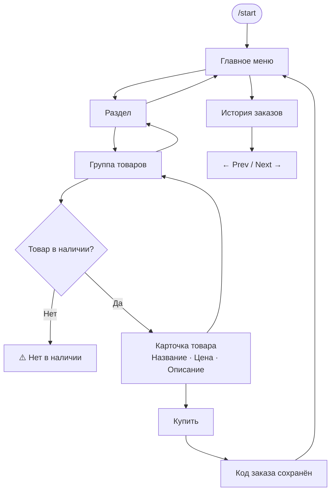

# Telegram bot (aiogram)

Минимальный бот на Python с кнопкой. При нажатии сохраняет информацию о пользователе
в JSON-файл базы данных.

## Быстрый старт

1. Установить зависимости.
2. Задать переменную окружения `BOT_TOKEN`.
3. Запустить бота.

## Пример (PowerShell)

```powershell
python -m venv .venv
.\.venv\Scripts\Activate.ps1
pip install -r requirements.txt

$env:BOT_TOKEN="ВАШ_ТОКЕН"
python .\bot\main.py
```

Данные сохраняются в `database/users.json`.

---

## Блок-схемы

### Для пользователя



### Для разработчика

```mermaid
flowchart TD
    subgraph Files["Файлы данных"]
        CF[content.json\nменю / кнопки / тексты]
        INV[inventory.json\nостатки товаров]
        HF[history.json\nзаказы пользователей]
        UF[users.json\nTelegram-профили]
        AMF[admin_messages.json\nлог рассылок]
    end

    subgraph Bot["bot/main.py  •  aiogram"]
        S[/start] --> SU[save_user] --> MM[show_main_menu]
        MM --> SEC[on_section\ncallback section:]
        SEC --> GRP[on_group\ncallback group:]
        GRP --> ITM[on_item\nпроверка инвентаря]
        ITM --> BUY[on_buy\nзапись history · -1 остаток]
    end

    subgraph Admin["Админ-панель"]
        AC[/all /to /cancel] --> AP[ADMIN_PENDING\nstate-машина]
        AP --> BC[Рассылка всем\nили конкретному ID]
        BC --> AMF
    end

    CF --> MM
    INV --> ITM
    BUY --> HF
    BUY --> INV
    SU --> UF

    subgraph Builder["webgui_builder/"]
        WEB[server.py + index.html] --> CF
    end
```
